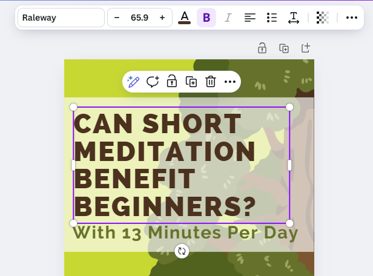

# Template and Titles
 
Let’s start to create an infographic using a Canva template. Remember that you are telling a story, and don’t have much space, so you can only present the most important highlights. If you have any questions, please ask, and don’t forget to have fun!

1. Create a Canva account at [canva.com](https://www.canva.com/){:target="_blank"}

    
     
2.  In the search field in the middle of the Canva home screen, type **tree planting infographic** and press the **Enter key** or click on the arrow button.
    - Find the template pictured in the screenshots in this lesson (the first result in our search) and then click on the **Customize This Template** button in the popup window.
    - This exercise will use the template in the example to the right and put facts and statistics from [this journal article on meditation](https://bit.ly/dsc-infographic-meditate){:target="_blank"} into the template in the form of graphics and text. If you decide to use a different template, please note that the instructions will differ from the template that you choose.
     
     
3. Start editing the template and change the graphics:
    - Delete the tree and the striped rectangle behind the title text by clicking on them and pressing **Delete** on your keyboard
    - Click on **Elements** in the left menu and search for hand drawn tree. When you see the Graphics category appear, click on **See All** to the right of it.
         
    - Scroll through the trees to find one that you like and drag it over into your design. The one in this example is several rows down the search results.
    - Click the **x** in the search field for Elements and grab the Square in the Shapes category to drag it over to the template.
      
           
    - To change the colour of the Square, click on the circle of the same colour seen up in the top bar menu. White was used in this example.
 
    - Additionally, you can decrease the transparency of the shape to allow the background graphics to show through by clicking on the Transparency menu item in the top bar menu and dragging the slider until you are satisfied.
          
4. Rearrange the layers to make sure your objects and text are in the order you want them to be:  
     - **Right click** on each object or text box and click on *Layer* and choose an option from the menu (e.g., Send Backward) to change the ordering. The text should be the top layer.
   
5. Enter the title text:
    -  **Double click** on the text at the top of the graphic, “Plant-A-Tree's”, and replace the text with, “**Can Short Meditation Benefit Beginners?**” (see photo).
    -  Drag down the green text “Help Plant 2 Million Trees” and change it to “**With 13 minutes per day:**”         
6. Use the text editing tools in the menu bar across the top of the software to adjust the text as needed:
   - Increase or decrease the text size to fit
   - Change the text alignment
   - Change the colours
         

Great Job! You are ready to move on to the next activity of Bar Charts & Text

[NEXT STEP: Bar Charts and Text](2-canva-charts.html){: .btn .btn-blue }
   
