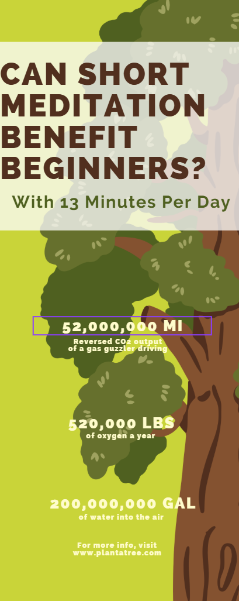
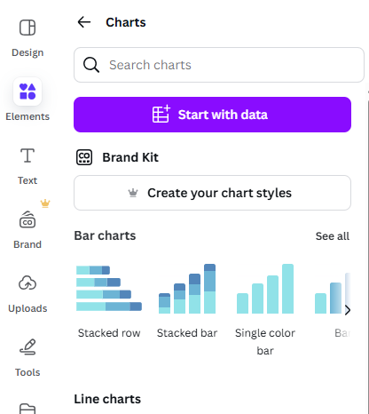
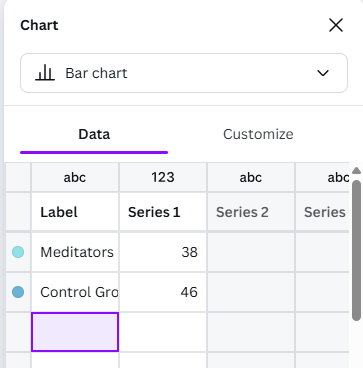
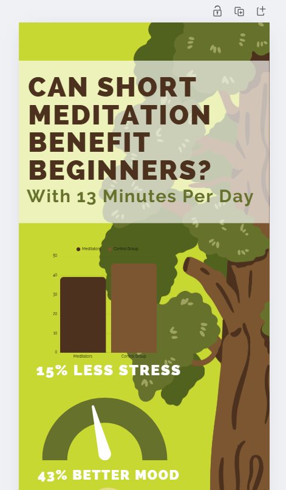

# Bar Charts & Text

Now that you have a title for your infographic, you start to add some facts and graphics below it. If you have any questions, please ask, and don’t forget to have fun!

1. We narrowed this study down to three main points we wanted to highlight and selected an infographic that also has three highlights, making our layout work easy with just a few changes:
  - We are first going to shift the graphics and text over to work with our title and main graphic. If you chose a different tree for the background, yours may align slightly differently to work around the background.
  - We won't be using the car, clouds, or raindrops, so those graphics can be deleted by clicking on them and pressing the delete key on your keyboard. (If there is a graphic you cannot select, this may be because your tree graphic is layered above them and needs to be sent to the back.)
  - You can then click on the text boxes and move them over to the side away from the tree. To select them all and move them at the same time, click on one and hold your Shift key and then click on the rest of them.
    
 

2. **Add a bar chart**: 
   
  - Click on **Elements** in the left toolbar. Scroll down to **Charts** and click on **See All**. Look for Bar Charts and again click on **See All**. Click on the blue upright Bar graph. 
  - While the Chart is selected, click on the **blue circle colour icon** in the top centre menu next to the **Edit** button. This will open up your colour palette. You want to change the chart to the same colours in the infographic. In this workshop example, we chose the colours of the tree bark to have the chart stand out against the green background.
    
  - Click on the **Edit** button to bring up the grid in the left sidebar, where you can fill in the information for your bar graphs, and the graph will automatically update. You can enter: **“Meditators” 39.2, and “Control Group” 46.2** for Items 1 and 2, and delete Items 3 and 4 and the numbers in the columns next to them.

  
    
   

 

3. **Add description text**:
  - Change the text below the graph to **15% Less Stress**
  - Delete the text box that is unused.
    
 

4. **Add another chart**
  - Go back into **Elements** and **Charts** and scroll down to find **Infographics Charts** and then click on **See all**.
  - There are some useful charts for infographics and research posters in this category (the Pictogram charts are fun) but this example we are going to use the Progress Dial. Click and drag it over into your design. 
  - Change the Percentage to 43, and adjust the Line Weight to a thickness you prefer. Change the colour using the menu options at the top.

Great Job! You are ready to move on to the next activity

[NEXT STEP: Graphics and Finishing Touches](3-canva-graphics.html){: .btn .btn-blue }
