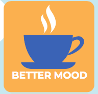
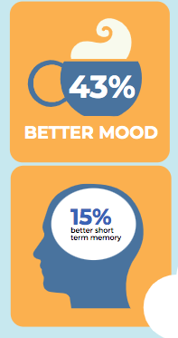
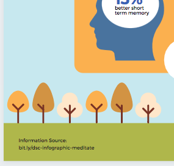
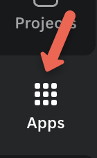

# Graphics & Finishing Touches
Now that you have a title and a chart in your infographic, we’ll now add some more graphics and a QR code, and tidy things up before exporting. If you have any questions, please ask, and don’t forget to have fun!

   
  

1. **Searching for graphics**:
  - Click on **Elements** in the left toolbar and type in the upper search bar “**coffee**”. Look for a coffee cup that is simple. Our goal is to find one that Canva allows us to change the colours to match our colour scheme, and also has space to put text over. 
  - The mug with the wisp of steam on it suits the purpose but the shading doesn’t match the style of the other graphic elements of the infographic -- which is key to a cohesive look. But because of the ability to change colours we can get rid of it. Drag the image into the second orange box. Click on the tan tile icons in the top toolbar to bring up the mug palette (see below).  Choose the same blue as is used in the rest of the design and do this for the other tan tiles until the mug and saucer are solid blue. For the darkest tile, change it to white for the steam. See right for the before and after.  
    <button onclick="toggle('gif1')">Show/Hide Animation</button>
    

     
    

   
  - For the last orange box, we are going to go back into **Elements** and search for **brain** and look for the graphic to the right. Add it to the last orange box, resize it, and change the head to blue, leaving the oval inside white. 
  - Use text boxes to **add the text** to your graphics:
      - 45% better mood
      - 15% better short term memory 
    <button onclick="toggle('gif2')">Show/Hide Animation</button>
    

     
    

2. **The Birds and the Trees**:
  - You can move the second little bird around to another spot on the infographic. Either on top of one of the boxes or a cloud, for instance. If you deleted the bird earlier, you can duplicate the other bird by selecting it and clicking the **Duplicate** button.
  - For added contrast, you may want to switch the bird to face another direction. To do this, click on the bird to select it, and click on **Flip** in the upper toolbar. 
  - You can also switch up the colours so that the bird has an orange body and yellow wing, for instance. 
  - The trees are now too tall since we have changed the alignment of the boxes. We can either shrink the trees down into smaller trees by selecting them and using the white handles to resize them, or go into **Elements** and search for different trees. If you replace the trees, make sure to change their colours so that they match the colour scheme of the infographic. Adding too many colours to an infographic creates visual clutter. Make sure to match the graphic style of the trees to the graphic style of the other elements in the infographic.
    <button onclick="toggle('gif3')">Show/Hide Animation</button>
    

      
    

   
3. Add your source:
  - Enter the URL for the source of this information at the bottom: [bit.ly/dsc-infographic-meditate](https://bit.ly/dsc-infographic-meditate){:target="_blank"}
4. Create a QR code with the short Bitly URL (how to create your own bit.ly URL is in the Bonus Skills activity #4):
  - Click on the black **Apps** button on the bottom of the left navigation bar (see image).
  - Type **QR Code** into the search field and then press enter on your keyboard.
  - Click on the white **QR Code** icon on the top left of the grid of search items.
   
  - Paste your shortened Bitly URL - https://bit.ly/dsc-infographic-meditate - into the while field that appears, and then click on the teal **Generate code** button.
  - Move the QR code that appeared on your infographic to the bottom right corner and resize it to fit the space available.
    <button onclick="toggle('gif4')">Show/Hide Animation</button>
    

      
    

5. **Finishing Touches**:
  - Take a look at the overall image and notice any alignment or balance issues. Is the title over to one side? Is that really where I want the bird or that cloud? You can add little detail touches like pulling the bottom cloud forward (right click and **Bring to Front**) and making it larger so that it slightly overlaps the bottom square to create a sense of depth (see final example). 
    <button onclick="toggle('gif5')">Show/Hide Animation</button>
    

      
    

    
6. **Exporting & Publishing**:
  - To save your new infographic so that you can publish it where you want, click on the white **Share** button on the top right of your browser, and then click the white **Download** menu item. Save your infographic file in a location on your hard drive where you can find it later.
  - Note: the PNG format is a good choice for a high-quality image you can use in a paper or post to social media. For poster printing, high-quality PDF is recommended.

Great Job! See the Take Home sheet and Extra Skills Activity sheet to build upon what you’ve learned here.

Below is an example of a Canva poster with a QR code and bit.ly (link is now closed/ deleted but shows you the idea!)
 

[NEXT STEP: Extra Skills](4-canva-extra-skills.html){: .btn .btn-blue }
