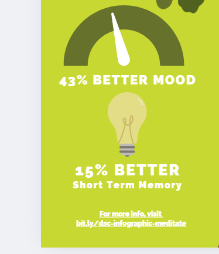

# Graphics & Finishing Touches
Now that you have a title and a chart in your infographic, we’ll now add some more graphics and a QR code, and tidy things up before exporting. If you have any questions, please ask, and don’t forget to have fun!

1. **Searching for graphics**:
  - Click on **Elements** in the left toolbar and type in the upper search bar “**lightbult**”. Look for a lightbulb that is simple and fits in well with the graphic style of the rest of the infographic. 
  - Click on the circle colour icons in the top toolbar to bring up the colour palette.   Choose colours that suit the rest of the design.
    
   
  
  - Use text boxes to **add the text** below your graphic:
      - 15% better short term memory 

2. **Make Adjustments as Needed**:
  - Feel free to move your background tree and/or any of the text boxes and graphics around now that you have most of your elements in the design and have a better feel of how it all fits together.
  - Make sure you save a little space at the bottom for a QR code.
 
3. Add your source:
  - Enter the URL for the source of this information at the bottom: [bit.ly/dsc-infographic-meditate](https://bit.ly/dsc-infographic-meditate){:target="_blank"}
4. Create a QR code with the short Bitly URL (how to create your own bit.ly URL is in the Bonus Skills activity #4):
  - Click on the black **Apps** button on the bottom of the left navigation bar (see image).
  - Type **QR Code** into the search field and then press enter on your keyboard.
  - Click on the black and white **QR Code** icon in the top left of the grid of search items and then click on the Open button that will appear.
   
  - Paste your shortened Bitly URL - (https://bit.ly/dsc-infographic-meditate){:target="_blank"} - into the while field that appears, and then click on the teal **Generate code** button.
  - Move the QR code that appeared on your infographic to the bottom right corner and resize it to fit the space available.

5. **Finishing Touches**:
  - Take a look at the overall image and notice any alignment or balance issues. Is the title over to one side? Is that really where I want the bird or that cloud? You can add little detail touches like pulling the bottom cloud forward (right click and **Bring to Front**) and making it larger so that it slightly overlaps the bottom square to create a sense of depth (see final example). 

    
6. **Exporting & Publishing**:
  - To save your new infographic so that you can publish it where you want, click on the white **Share** button on the top right of your browser, and then click the white **Download** menu item. Save your infographic file in a location on your hard drive where you can find it later.
  - Note: the PNG format is a good choice for a high-quality image you can use in a paper or post to social media. For poster printing, high-quality PDF is recommended.

Great Job! See the Take Home sheet and Extra Skills Activity sheet to build upon what you’ve learned here.

Below is an example of a Canva poster with a QR code and bit.ly (link is now closed/ deleted but shows you the idea!)
 

[NEXT STEP: Extra Skills](4-canva-extra-skills.html){: .btn .btn-blue }
