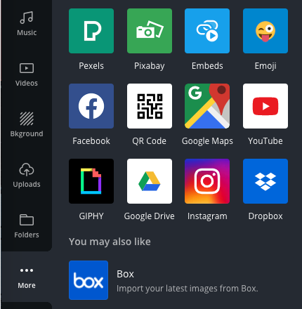
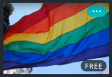
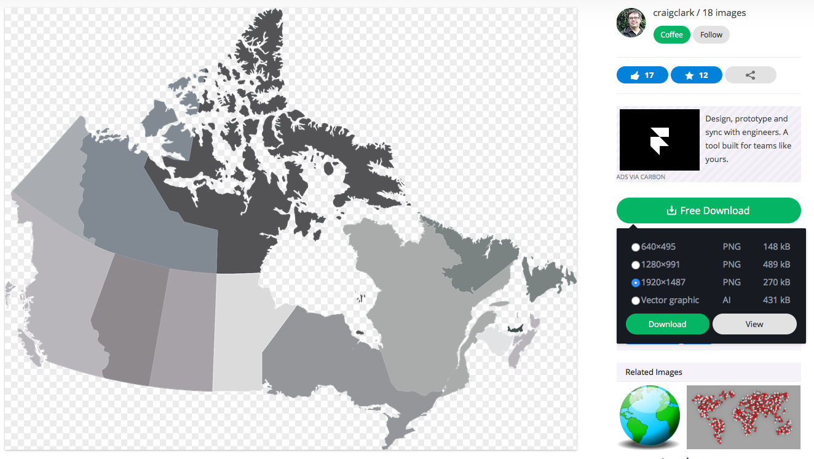

# Extra Skills with Canva
Here are a few added Canva skills and tip to expand your knowledge:
 

1. **Add a photo to your project using Canva’s Pixabay option**:
  - Click on the black More button on the bottom of the left navigation bar (see photo).
  - Click on the green Pixabay icon.
  - In the search box that appeared at the top, type in a keyword for your search, and press Enter. Note: all Pixabay photos are free for commercial use with no attribution required. If attribution is required for your project, you can find details by mousing over the image in the search results and clicking on the three dots that appear in the upper right corner of each image (see photo). 
  - Click once on a picture. The picture will appear in your infographic.
  - Grab a round, white handle at one of the corners of the photo to resize the image while maintaining aspect ratio. 
  - To crop the image, hold down the shift key while dragging the round corner handles. Once the image is cropped down to the size you want, you can also double click on it and drag the image around inside the cropped window to get it situated the way you want (see photo). 

    <button onclick="toggle('gif1')">Show/Hide Animation</button>
    

    
    

2. **Tips for searching for clipart in Canva**:
  - If you are searching for graphic elements and none of the results that come up are free, try thinking of different words to use for your searches. 
  - For example: a search in Canva for “syringe” brings up only one free option, but a search for “needle” brings up an additional result. 

3. **When you can’t find the free clipart you need on Canva (an example search for a vector map of Canada with a transparent background)**:
  - Open a new tab & go to [Pixabay](https://pixabay.com){:target="_blank"} to find free licensed images and drawings.
  - In the search box type, **map canada**, and press Enter. Click on the map you’d like to use (look for one with a blank grey background if you want it to be transparent).
When you get into the individual image page, the image you’ve chosen will have a checkered grey background to indicate that it will be transparent once added to your document
(see image).

   

  - Click on the green **Free Download** button on the right of the screen and select the highest resolution PNG file. Note where your browser saves the image file.
  - Go back to Canva, and click on the black **Uploads** button to the left of the screen. 
  - Next click on the green Upload an image or video button.
  - Navigate to where you saved the map of Canada, select the file, & click **Open**.
  - Click on the thumbnail image of the map of Canada in the left panel, and the map will appear in your infographic.
  - Unlike the graphic elements you can use in Canva, these images you upload will not have the option to change colours to match your document, so keep that in mind when choosing them.
  - Additional Creative Commons Photo and Clipart websites:
    -   [Unspash](https://unsplash.com){:target="_blank"} (images)
    -   [Pexels](https://www.pexels.com){:target="_blank"} (images)
    -   [Create Biology figures](http://BioRender.com){:target="_blank"} (clip art)
    -   [Full colour clip art with transparent background](https://vectorstock.com){:target="_blank"} (clip art)
    -   [Free icons to help describe your research story](https://thenounproject.com){:target="_blank"} (clip art)
    -   [Google Advanced Image Search](https://www.google.ca/advanced_image_search){:target="_blank"} (imeages & clip art)
    -   [CreativeCommons image search](https://search.creativecommons.org/){:target="_blank"} (images)

4. We used Bit.Ly to create a short URL for our article and that can be useful to link back to your source without taking up a lot of space or having an obnoxiously long link for someone to remember. Here’s how:
  - Open a new tab in your web browser and go to: [bitly.com](https://bitly.com/){:target="_blank"}
  - Hopefully, you still have your article or the article you are basing your infographic on. Paste the URL for your article into the Shorten your link field on the Bitly web page and then press the blue **Shorten** button (see below).

  

  - You will then see another box appear below with a very short URL that will link to the very long URL that you pasted above (see below). It will be in the form of, https://bit.ly/Sh0Rt  Press the blue **Copy** button. 

  

  - Go back to your Canva tab in your web browser and paste in: bit.ly/your-short-url-here (make sure to delete the leading https:// as it’s not needed here (see the top of the previous page for an example).
    - _Note: bit.ly also allows you to create custom links if you want._

Great Job!

[NEXT STEP: Social Media Slides](5-canva-social-media.html){: .btn .btn-blue }
