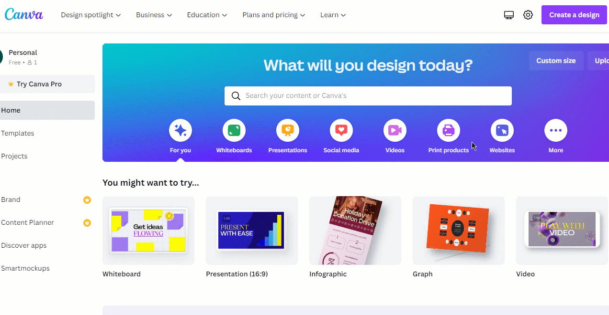
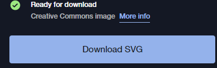
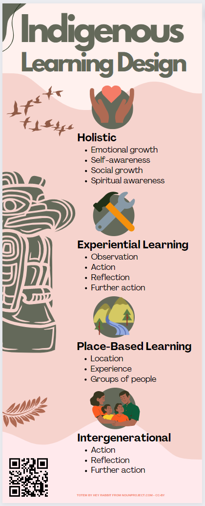

# Indigenous Pedagogy Infographic

Let’s create an indigenous pedagogy infographic using a Canva template. Remember that you are highlighing the key points, and don’t have much space, so you can only present the most important 3 or 4 highlights. If you have any questions, please ask, and don’t forget to have fun!

 

1. From the Canva homepage, click on the purple **Create a design** button on the top right of the screen. 
  - Type **infographic** in the search box in the top right, and then click on the infographic just below the search box.
  - Type **Pink Motherhood Maternity** in the search field on the left and click on the mainly pink "New Chapter Maternity" template (see right).
  - This exercise will use the template in the example to the right and put facts and statistics about Indigenous Learning Design into the template in the form of graphics and text. If you decide to use a different template, please note that the instructions will differ from the template that you choose.

2. Start editing the template and make the title:   
  - **Double click** on the text at the top of the graphic, “New Chapter”, and replace the text with “**Indigenous Learning Design**”.  
  - Delete the "maternity" subtitle.

  <button onclick="toggle('gif1')">Show/Hide Animation</button> 
  
 
  
  

3. Replace the butterflies and flowers with a flock of birds and a fern.  Click Elements in the left toolbar, then type **birds** in the search bar.  Drag the flock of birds icon over to the infographic.

      

  - While you have the birds selected, you can change the colour. Click on the square in the top toolbar,then select the brown square under **Document Colors** to make the bird icon brown. 
  - Search **fern** from the elements toolbar and change the colour.

4. Replace the circular icons: 
  - Search for elements using the keywords **hands and help**, **tools**, **mountain**, and **family**
  - For each of the four sections, add textboxes for **Holistic, Experiential Learning, Place-Based Learning,** and **Intergenerational**.
  - Replace the small text with bullet points describing each section.

  <button onclick="toggle('gif2')">Show/Hide Animation</button> 
  
 
  
  

    

5. Add a totem image and resize it. 
  - Click this link to [Download a totem icon from the noun project](https://thenounproject.com/icon/totem-4721829/){:target="_blank"}. 
    - choose the free download option, then select Download SVG.
    
  - Click Uploads on the left toolbar, then Upload Files.  Select the totem image you just downloaded and drag it onto your canvas.
  - Resize the image by clicking on it once, dragging the round, white handles until it is bigger, Then drag it to the left of the infographic. 
  - The image attribution for the totem is cut off, so we will replace it:  
    - From the elements menu select a box and change the colour to match the background
    - Make a new text box with an image attribution: **Totem by Hey Rabbit from NounProject.com - CC-BY** 
    - Change the text colour to red

  <button onclick="toggle('gif3')">Show/Hide Animation</button> 
  
 
  
  

6. Add a QR code.
  - copy this link to a description of Indigenous pedagogies: [https://bit.ly/dsc-pt](https://bit.ly/dsc-pt){:target="_blank"}
  - go to [QR Code Generator](https://msystems.net/qr/){:target="_blank"} and copy the link from above to generate a QR code.
  - Upload the QR code to Canva (see previous step for instructions) and drag it onto the bottom of the infographic.

   

Great Job!

[NEXT STEP: Plan your Infographic](7-canva-infographic-plan.html){: .btn .btn-blue }
