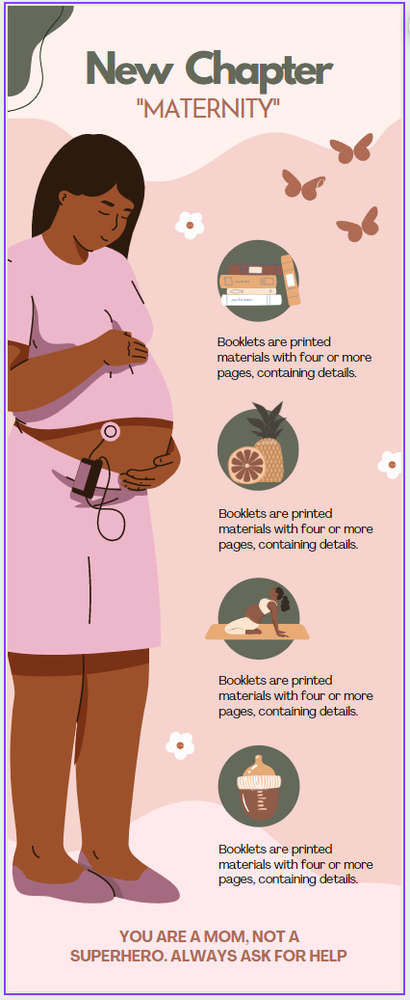
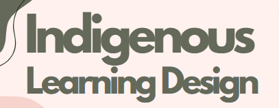

# Indigenous Pedagogy Infographic
 

Let’s create an indigenous pedagogy infographic using a Canva template. Remember that you are highlighing the key points, and don’t have much space, so you can only present the most important 3 or 4 highlights. If you have any questions, please ask, and don’t forget to have fun!

1. If you haven't done so already, please create a Canva account at [canva.com](https://www.canva.com/){:target="_blank"}

2. Click on the purple **Create a design** button on the top right of the screen. 

   

  - Type **infographic** in the search box in the top right, and then click on the infographic just below the search box.
  - Type **Pink Motherhood Maternity** in the search field on the left and click on the mainly pink "New Chapter Maternity" template (see right).

  <button onclick="toggle('gif1')">Show/Hide Animation</button> 
  
 
  
  

  - This exercise will use the template in the example to the right and put facts and statistics about Indigenous Learning Design into the template in the form of graphics and text. If you decide to use a different template, please note that the instructions will differ from the template that you choose.

    

3. Start editing the template and make the title: 
  - **Double click** on the text at the top of the graphic, “New Chapter”, and replace the text with “**Indigenous Learning Design**” (see photo).  
  - Replace the butterflies with a flock of birds and a fern.  Click Elements in the left toolbar, then type **birds** in the search bar.  If the birds are behind the text box, select the text box, right-click on it to bring up a menu, click on “Send backward” to move the text box back a single layer. This will move it behind the bird, enabling you to reach the bird. 
  
    

  - Click off to the side to deselect the text box, and try to click on the bird now. 
  - While you have the birds selected, you can change the colour of the birds. Click on the color square in the top toolbar,then select the brown square under Document Colors to change the colour to brown.
  - Search **fern** from the elements toolbar and repeat step 3 with a fern icon.

  <button onclick="toggle('gif2')">Show/Hide Animation</button>
  

  
  

4. Delete the "Maternity" subtitle and white flowers.

5. Replace the circular icons with relevant icons.  For each section, add the titles **Holistic, Experiential Learning, Place-Based Learning,** and **Intergenerational**.

6. Add a totem image and resize it. 
  - [Download a totem icon from the noun project](https://thenounproject.com/icon/totem-4721829/). 

  

  - Click Uploads on the left toolbar, then Upload Files.  Select the totem image you just downloaded and drag it onto your canvas.
  - Resize the image by clicking on it once, dragging the round, white handles until it is bigger, Then drag it to the left of the infographic. 
  - Replace the bottom text with an image attribution, **Totem by Hey Rabbit from NounProject.com - CC-BY**

  <button onclick="toggle('gif3')">Show/Hide Animation</button>
  

  
  

 

7. Change the text under each heading to match the final infographic image.

8. Add a QR code.

Great Job! You are ready to move on to the next activity.

[NEXT STEP: Plan your Infographic}](7-canva-infographic-plan.html){: .btn .btn-blue }
