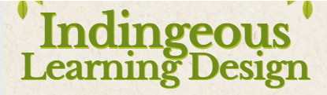
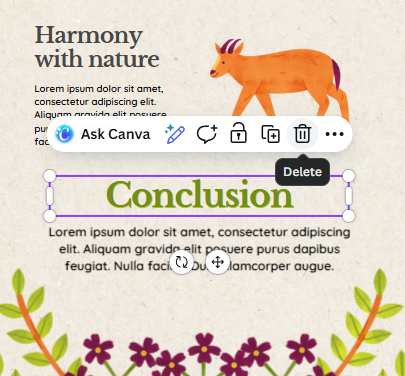
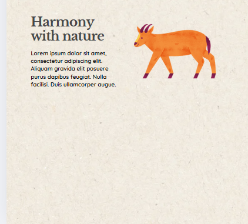
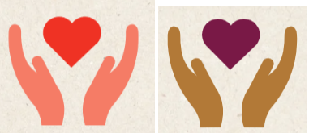
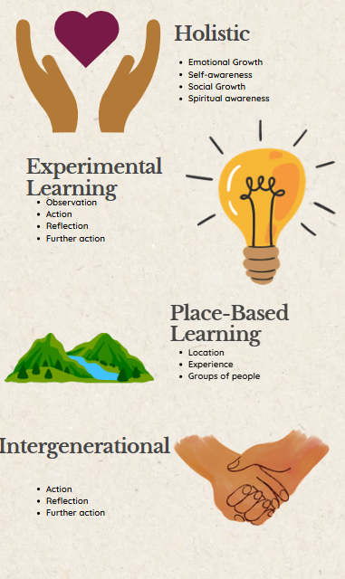
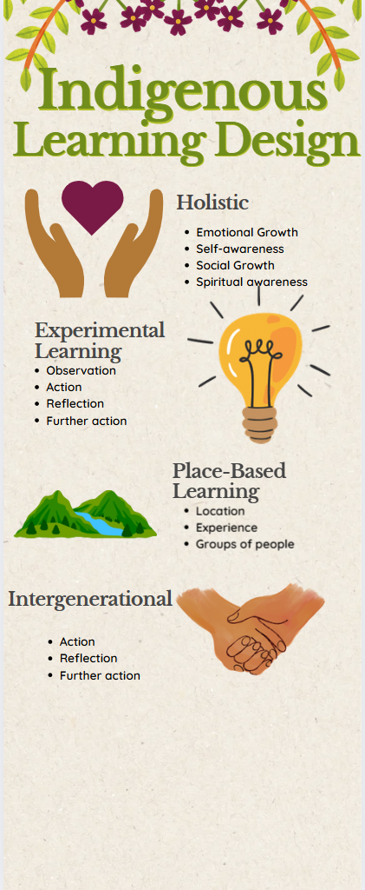
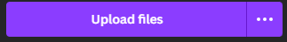
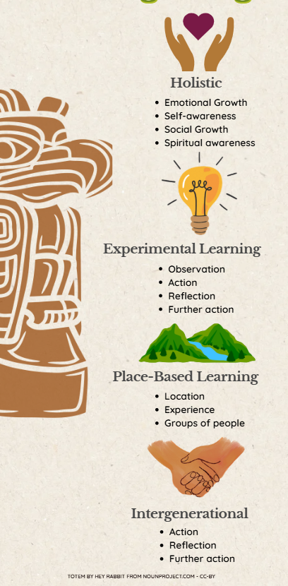
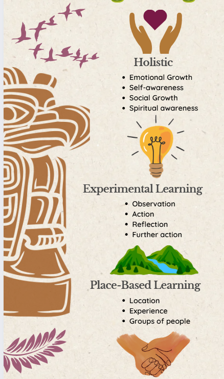
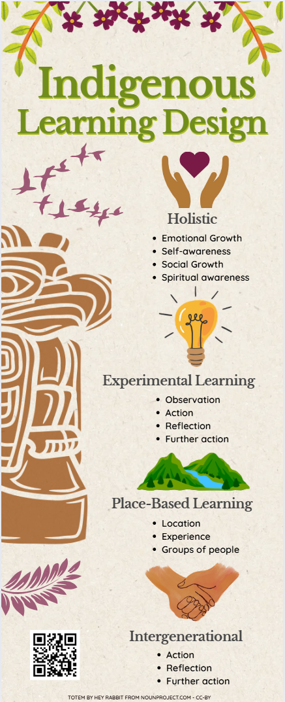

# Indigenous Pedagogy Infographic

Let’s create an indigenous pedagogy infographic using a Canva template. Remember that you are highlighing the key points, and don’t have much space, so you can only present the most important 3 or 4 highlights. If you have any questions, please ask, and don’t forget to have fun!

 

1. From the Canva homepage, click on the purple **Create a design** button on the top right of the screen. 
  - Type **infographic** in the search box in the top right, and then click on the infographic just below the search box.
  - Type **Beige and Green Floral Life In Nature Infographic** in the search field on the left and click on the template (see right).
  - This exercise will use the template in the example to the right and put facts and statistics about Indigenous Learning Design into the template in the form of graphics and text. If you decide to use a different template, please note that the instructions will differ from the template that you choose.

2. Start editing the template and make the title:   
  - **Double click** on the text at the top of the graphic, “Life in nature”, and replace the text with “**Indigenous**" and then change the text size to 83.
  -  Then duplicate the text box by right clicking on it and selecting “Duplicate”. Gently drag it downwards and turn the text size down to 65 and replace that text with “**Learning Design**”.
  -  Extend the text box horizontally so that it fits as one line of text. Slightly lower the two text boxes (you can select both by clicking one, holding shift and then clicking the other) so they aren’t intersecting with the plant border along the top.
  -     
  <button onclick="toggle('gif1')">Show/Hide Animation</button>
3. Delete the border of plants on the bottom by clicking on it and hitting **Delete** on the keyboard. Also delete the “Conclusion” and paragraph beneath it. This will give us more room to adjust the formatting.
    
   

4.Search for elements using the keywords **hands helping heart**, **experimental learning**, **mountain and water** , and **hand holding**.

Tip: You can change the colours of some clip arts! To do this, select your clip art and look up to the bar at the top of the window. If you can change the colours, there should be a coloured circle that represents the colour of the icon. Click on them to change the colours to your liking! It even gives you colours within the palette of your template to choose, that’s what I did here. 
   
    

 5. Let’s change the subtext size from 14 to 20 by **double clicking** one of them and then pressing “**CTRL+A**” to select the whole textbox.
  -Once selected, navigate to the top of the window. You will see “Quicksand” (this is the font) and next to it the text size. **Click** the 14 and if it turns blue you can type “20” and press enter to replace the number. Your text should be larger now. Do this with all 4 subtext boxes. 
    
6. Next step is we want to move all of the headers, subtexts, and icons to the right side of the screen to be in a column. This can get a bit messy and there is no right or wrong way to do it! I would start with the **Intergenerational** section as it is closest to the bottom. Simply click and drag the subtext and move it down towards the right bottom corner of your infographic. Now bring the header over and then the hand holding icon. Now bring the **Place Based Learning** information and icon over and continue, working bottom to top. You can resize your images to be smaller and while you drag your items around on the workspace, you will see faint purple lines showing up, which are guidelines. They show you where things match up. Aim for a purple line going through the centre of your objects, meaning they are all aligned along a vertical center line. This may take a few minutes to perfect! 
 
  <button onclick="toggle('gif1')">Show/Hide Animation</button>
  
7. Add a totem image and resize it. 
  - Click this link to [Download a totem icon from the noun project](https://thenounproject.com/icon/totem-4721829/){:target="_blank"}. 
    - Click **Get This Icon**, choose the free **Basic Download** option, then select **Continue**.  Click **Download SVG** to download the file to your computer.
    
  - In Canva, Click **Uploads** on the left toolbar, then **Upload Files.**  Select the totem image you just downloaded and drag it onto your canvas.
  - Resize the image by clicking on it once, dragging the round, white handles until it is bigger, Then drag it to the left of the infographic.
  - To change the colour of the image to match the infographic, cick on **Edit** at the top of the page with the totem pole selected and then go to "fx Effects" on the left hand side of the screen.
  - Choose **Duotone** and change the Highlight colour by clicking on the circle next to it. Change the colour to **#ff4a4a** and change the shadows colour to **#994e11**. They should look red and brown now and your totem pole should be a light brown. 
  - The image attribution for the totem is cut off, so we will replace it:  
    - From the elements menu select a box and change the colour to match the background
    - Make a new text box with an image attribution: **Totem by Hey Rabbit from NounProject.com - CC-BY**
    - Change the text colour to a warm earthy colour from the palette such as orange or brown.
     
8. Add some additional pieces of art that fits with the design from the **Elements** section on the left hand side of the screen. Search for "ferns" or "birds" and then decorate your template's white space.
Tip: Change the colour of your icon to a colour in your template's colour palette for more cohesiveness. We chose the burgundy colour and turned the transparency down to about 65%.
 

9. Add your QR code 
-Copy this link to a description of Indigenous pedagogies: https://bit.ly/dsc-pt
-Go to QR Code Generator on Canva by clicking on Apps on the left hand side and then searching QR Code. Select the one that is just called QR Code and copy the link from above to generate a QR code.
-Drag it onto the bottom left open space of the infographic.

You are now done!  

