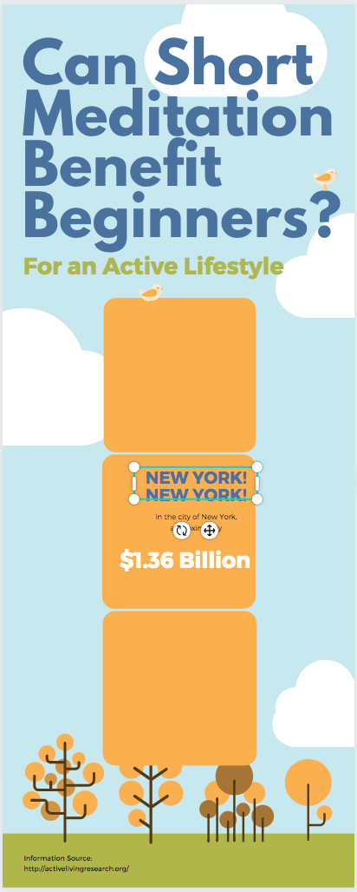
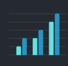
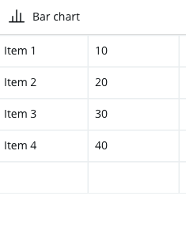
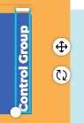
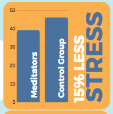

# Bar Charts and Text

Now that you have a title for your infographic, you start to add some facts and graphics below it. If you have any questions, please ask, and don’t forget to have fun!

1. We narrowed this study down to three main points we wanted to highlight so we will only be using three of the orange boxes:
  - Click on one of the empty boxes to select it and press your delete key on your keyboard.
  - Drag the three boxes so that they are in a vertical row with a small amount of space between them. Canva will alert you with a red bar that goes all the way from the top to the bottom of the document when you centre the boxes successfully. 
  - You can put the first box where you want it, then put the second box right next to it with the edges touching, and then use your arrow keys on your keyboard to nudge it two or three steps away. Then put the third box touching the next box and move it the same number of spaces.

2. **Add a bar chart**:
 
 - Click on **Elements** in the left toolbar. Scroll down to **Charts** and click on **See All**. Click on the blue upright bar graph. 
  - While the Chart is selected, click on the **blue square colour icon** in the top left next to the **Edit** button. This will open up your colour palette. You want to change the chart to the same blue in the infographic.If you mouse over the other tiles, you will see the hex numbers come up, you want the one that is #537ea8. 

  - Click on the **Edit** button to bring up the grid in the left sidebar, where you can fill in the information for your bar graphs, and the graph will automatically update. You can enter: 39.2, 46.2 into the second columns for Item 1 and 2, and erase the rest of the information. For this example, the hanging auto-generated text doesn’t fit well with the squares in the template, so we are going to leave it out of the chart information and enter it into text boxes instead for a nicer look. (see above for side by side comparison)

 
  - If you’ve kept the white text box (in the orange box), you can duplicate it by selecting it and clicking the **Duplicate button**, and replace the text with “Meditators” and “Control Group”. Resize the font to fit. In this example, we have used the template font Montserrat Classic with a size 20. (You will need to right-click on your chart and “send backward” so that the text sits on a higher layer or it will disappear behind the chart.) (You may want to left justify the text in the box.)
  - Use the little handles by the text box to move it around and rotate it.

3. **Add description text**:
 
 - To stick with the upright theme of this bar chart, we are going to put in the text upright as well. If you’ve left in the blue “New York” text, you can pull it up and change it to “STRESS”, change it to font size  56 and rotate it 90 degrees to match the bars. If you haven’t saved a text box, you can duplicate one of the text boxes from the chart and change the colour to the same blue (#537ea8).
  - Duplicate the text box, change the text to white, size 34, and write “15% less”. 

  - You can use the arrow keys to shift things around inside the orange box.
  - The bar chart can also be resized using the round and narrow handles. 

Great Job! You are ready to move on to the Graphics & Finishing Touches activity

[NEXT STEP: Graphics and Finishing Touches](canva-graphics.html){: .btn .btn-blue }
