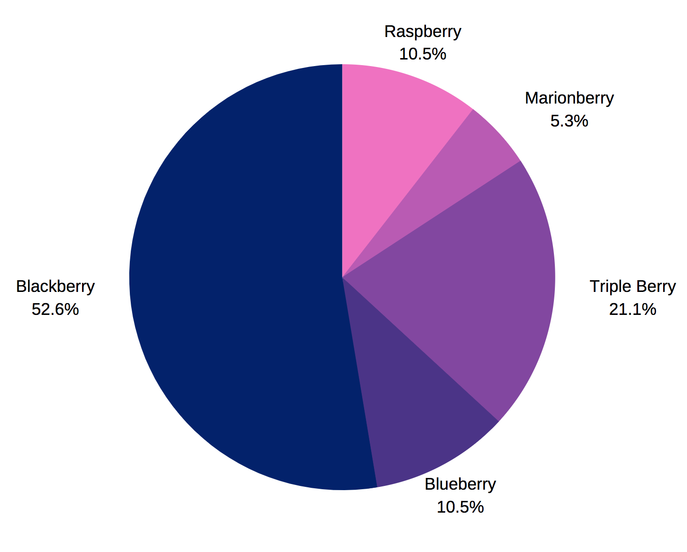
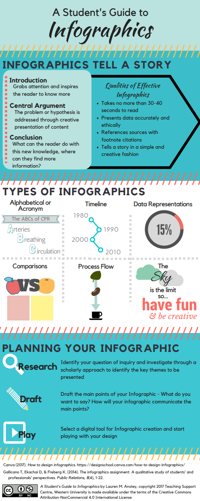

# Planning your Infographic and Gathering Data
 
1. For this exercise, you can use your own research or use data from a [research article titled Brief](https://www.bit.ly/dsc-infographic-meditatebit.ly/dsc-infographic-meditate){:target="_blank"}, daily meditation enhances attention, memory, mood, and emotional regulation in non-experienced meditators, in order to build skills before you start work on your own infographic.

2. Determine which facts in the article are essential and which can be excluded in order to tell a story in a compelling yet concise way. In the meditation article (or your research), some facts & statistics that look interesting are: 
  - a.______________________________________________________________________________________________________________________
  - b.______________________________________________________________________________________________________________________
  - c.______________________________________________________________________________________________________________________
  - d.______________________________________________________________________________________________________________________
  - e.______________________________________________________________________________________________________________________
  - f.______________________________________________________________________________________________________________________
3.  Determine which facts and statistics you have brainstormed that you will eventually summarize and translate into tables, charts, or graphical representations. This will usually be only 3 or 4 items: 
  - a.______________________________________________________________________________________________________________________
  - b.______________________________________________________________________________________________________________________
  - c.______________________________________________________________________________________________________________________
  - d.______________________________________________________________________________________________________________________
4. Where you feel they will have a positive impact on your story, integrate and summarize visual information from photographs, videos, clipart, or maps into a graphical representation. For this example, some ideas are: 
  - a.______________________________________________________________________________________________________________________
  - b.______________________________________________________________________________________________________________________
  - c.______________________________________________________________________________________________________________________

5. Determine the best order and flow of information to create a visual narrative integrating the key tables, charts, and graphics. The order the information is presented in the research may not be the best way to present it in an infographic. See the graphic to the right for some ideas for flow (e.g., alphabetic order, timeline order, comparison, process flow). Take your points from Step 3 and put them in your chosen order of flow here (or sketch them roughly in the blank space below): 
  - a.______________________________________________________________________________________________________________________
  - b.______________________________________________________________________________________________________________________
  - c.______________________________________________________________________________________________________________________
  - d.______________________________________________________________________________________________________________________
6. If you haven’t already, use the workshop activities to practice building an infographic in Canva.

Great Job!

[Photo credit](https://www.flickr.com/photos/dashburst/8448339735/in/photolist-kee8qu-dSxX4V){:target="_blank"}: What makes a good infographic, Daniel Zeevi - flickr - CC-BY-ND

[NEXT STEP: Bonus Take Home Sheet](canva-bonus-sheet.html){: .btn .btn-blue }
