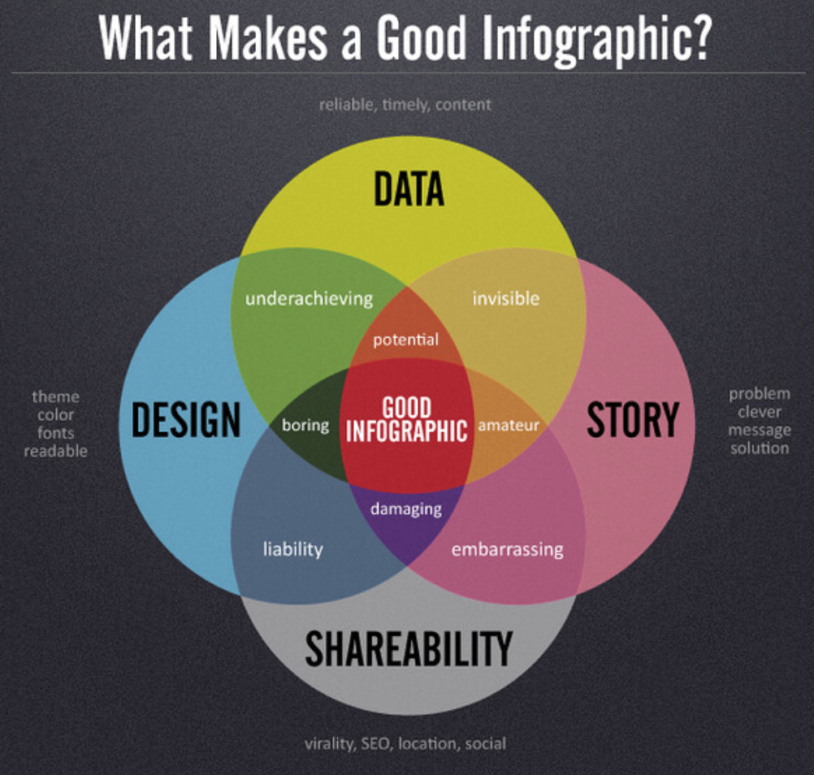

 

# Introduction to Infographics

- Pre-workshop activities: 18 min 
- Introductory presentation: 10-15 min
- Hands-on activities: 50-60 min

## Why Canva? 
[Canva](https://www.canva.com/){:target="_blank"} is a free graphic design tool that helps users create customizable infographics, posters, brochures, cards, social media posts and more. Canva has numerous templates and features that can act as inspiration and can be changed according to your goals. This tool is web-based and works like Google Docs but for layout with design elements). It auto-saves your work so you can work across multiple computers and collaborate with teammates. Canva has a free and a premium tier. This workshop goes over how to utilize the free tools within Canva. Even in the free side of Canva, there are options to use pay-as-you-go elements (clip art and photos) but they aren’t necessary to design excellent work in this software.

## Learning objectives
Participants will be able to know and do the following by the end of this workshop:

1. Know why and where infographics can be useful communication tools.
2. Determine which facts in a research paper or article are essential and which can be excluded in order to tell a compelling yet concise story.
3. Summarize and translate quantitative data into tables, charts, or graphical representations.
4. Summarize and translate quantitative information expressed in words into tables, charts, or graphical representations.
5. Where appropriate, integrate and summarize visual information from photographs, videos, or maps into a graphical representation.
6. Determine the best order and flow of information to create a visual narrative integrating the key tables, charts, and graphics.
7. Be able to use infographic software and associated templates to organize and present tables, charts, and graphical representations in a narrative that is aesthetically pleasing and compelling.
8. Be aware of the different mediums available to publish and share infographics: Poster, hand-out, website, and social media.

[Photo credit](https://www.flickr.com/photos/dashburst/8448339735/in/photolist-kee8qu-dSxX4V){:target="_blank"}

[NEXT STEP: Pre-Workshop Activities](pre-workshop.html){: .btn .btn-blue }
