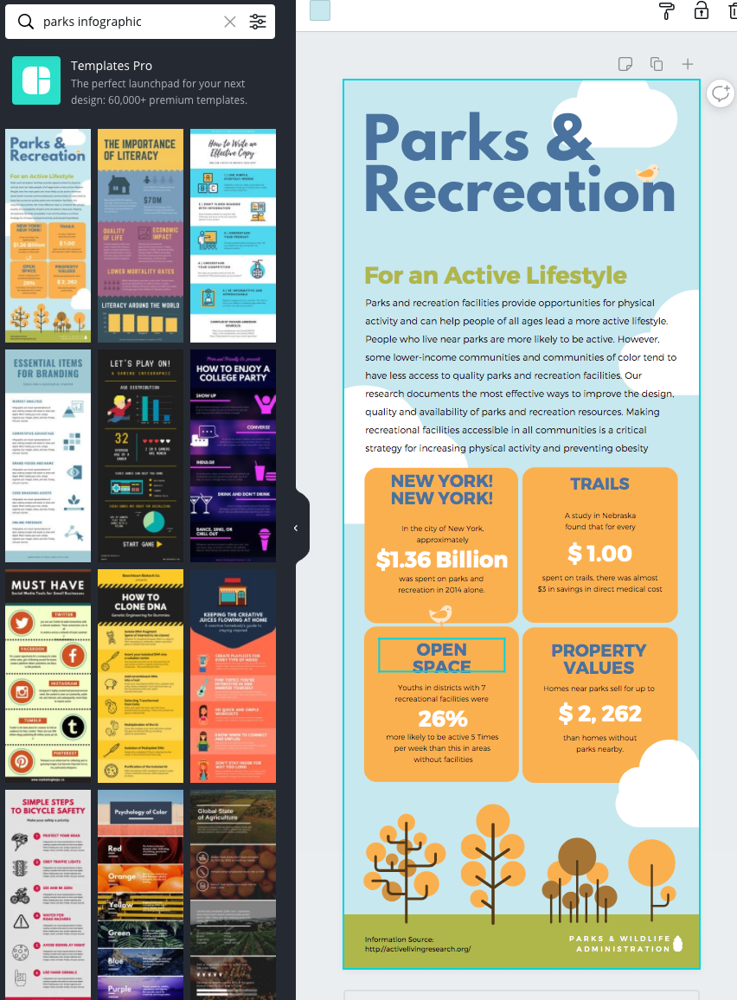
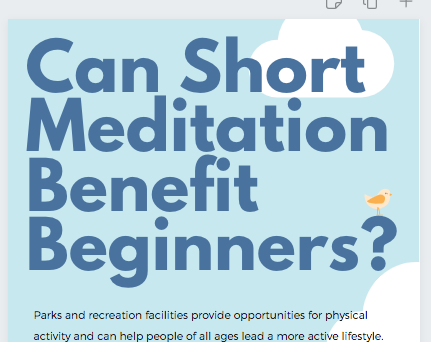
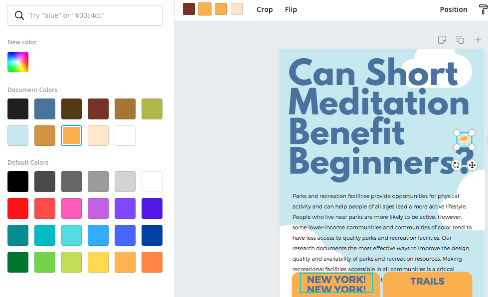

# Indigenous Pedagogy Infographic
 
Let’s create an indigenous pedagogy infographic using a Canva template. Remember that you are highlighing the key points, and don’t have much space, so you can only present the most important 3 or 4 highlights. If you have any questions, please ask, and don’t forget to have fun!

1. If you haven't done so already, please create a Canva account at [canva.com](https://www.canva.com/){:target="_blank"}

2. Click on the purple **Create a design** button on the top right of the screen.
   
  - Type **infographic** in the search box in the top right, and then click on the infographic just below the search box.
  - Type “parks” in the search field on the left and click on the blue and orange Parks & Recreation template (see right).
  - This exercise will use the template in the example to the right and put facts and statistics from [this journal article on meditation](https://bit.ly/dsc-infographic-meditate){:target="_blank"} into the template in the form of graphics and text. If you decide to use a different template, please note that the instructions will differ from the template that you choose.

   
3. Start editing the template and make the title: 
  - **Double click** on the text at the top of the graphic, “Parks & Recreation”, and replace the text with, “**Can Short Meditation Benefit Beginners?**” (see photo). You can move the little bird to sit on one of the characters if wanted. If the bird is behind the text box, select the text box, right-click on it to bring up a menu, click on “Send backward” to move the text box back a single layer.This will move it behind the bird, enabling you to reach the bird. Click off to the side to deselect the text box, and try to click on the bird now. Also, note that while you have the bird selected, you can change the colours of the bird. (see right) Click on the colours in the top toolbar to change the colours if wanted. Currently, the bird matches the colour scheme, so if you change the bird colours, it will no longer match the text boxes, the trees, or the second bird, so keep this in mind for later. 

4. Drag down the green text “For an Active Lifestyle” and change it to “**With 13 minutes per day:**” 
5. You can choose to either move the cloud on the right-middle so that it is no longer blocking the question mark in the title or right-click on it and click “send backward” to move in a layer behind the text box. See which one you like the look of best. 
6. Resize the cloud behind “Short” so that it is bigger. Do this by clicking on it once, dragging the round, white handles until it is bigger. Then drag it back up into position to highlight the importance of the word “Short”. 

7. The next step is to clean up the design a little to make some space for more elements. We don’t want to erase everything and lose all our nice formatting, though, so we will just delete some of it. You can see to the right that we have kept some elements for reference. This helps give you space to test out new ideas. 

Great Job! You are ready to move on to the next activity of Bar Charts & Text

[NEXT STEP: Bar Charts and Text](canva-charts.html){: .btn .btn-blue }
